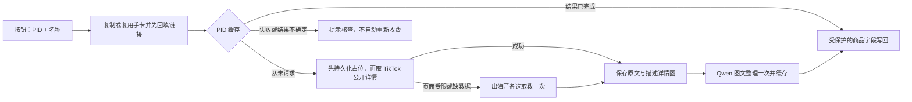

# PID 商品资料与手卡按钮

## 本次业务范围

用户确认：点击现有“补录手卡”按钮时 **PID 必填，产品名称可不填**；系统可从精确 PID 商品资料取得名称并用于文档命名。PID 是唯一商品身份，不从网址英文名判断商品。美国市场固定 `us`。商品资料优先读取该 PID 对应的 TikTok 美国站公开商品详情数据；公开页面不可用时才调用出海匠。Qwen 读取文字与商品描述区域详情图，主商品图和 SKU 图不参与分析；详情图最多 8 张。（根据项目负责人确认）

所有表格入口共用 `/api/feishu/automation`。按产品文件夹中完整 `_PID` 后缀寻找手卡；多个匹配时选最近编辑的一份，名称规范为 `产品名称_PID`。名称含“测试”仍新建文档，但不改变 PID 级缓存规则。（根据代码实现及项目负责人既有确认）

已有商品基础资料允许更新，但新资料未提供的字段不能清除原有内容；分析期间被人工改动的字段跳过。视频文件、视频分析、中文翻译以及其他手写段落不属于本次商品资料写入范围。

## 旧手卡如何补资料

在原多维表格找到该产品，确认产品名称和完整 PID，重新点击“补录手卡”即可；不用删除旧卡或清空旧链接。系统会复用产品文件夹中匹配该 PID 的手卡，更新六项商品基础资料，而不是只填写空值。接口新资料缺失的字段仍保留原文。已有 PID 缓存时直接复用，尚未取数的 PID 才首次请求；失败记录不会因重复点击而解除。

这不是自动批量补历史资料的任务。名称含“测试”仍会新建手卡；旧卡未放在产品文件夹、名称没有完整 `_PID` 后缀，或正文缺少基础字段时，需要先核对定位/模板，不能保证按钮会识别为该旧卡。同 PID 多份手卡只处理最近编辑的一份，不遍历重写全部旧卡。

## 处理过程

1. 校验名称、PID，复制模板或复用手卡，首先回填当前行的手卡链接。
   PID 必须保留完整数字文本；如果飞书以超过安全整数范围的数字类型传入，则在建卡/收费前停止，要求改成文本字段重新粘贴，不能拿舍入后的 ID 取商品。
2. 检查模板的字段是否重复、正文商品 ID 是否冲突；没有任何可填写的商品资料字段时，不调用收费服务。
3. 更新身份字段。读取 PID 的长期缓存；没有历史请求时，先记录请求占位，再读取一次 TikTok 公开商品页；页面受限、缺数据或 PID 不匹配时才调用出海匠一次。
4. 原响应和下载的详情图保存到云端持久卷。Qwen 接收商品文字及最多 8 张商品描述区域详情图，输出六项结构化资料，并为每项保留来源编号。主图和 SKU 图仅作为来源元数据保存，不送入模型。
5. 结果永久缓存。仅回写六个指定基础字段；可支持的事实写入，无依据的字段写“未找到”（已有内容不清空），推断明确标注。
6. 状态回写当前行的“手卡状态”，不是视频文件所在格。部分图片缺失、字段缺失或资料矛盾作为提示，不阻止其余有依据的内容写入。

## 模块边界

| 文件 | 职责；以后改什么时看这里 |
| --- | --- |
| `lib/products/catalog.ts` | PID 级编排、同 PID 合并、缓存恢复、商品队列 |
| `lib/products/catalog-store.ts` | MySQL 原子占位与状态更新 |
| `lib/products/catalog-source.ts` | 出海匠单次请求、私有文件缓存、图片下载/格式验证 |
| `lib/products/tiktok-public-source.ts` | TikTok 公开商品详情读取、精确 PID 校验、公开来源缓存 |
| `lib/products/catalog-analyzer.ts` | 可配置 AI（默认 Qwen）提示词、结构化输出和字段级来源检查 |
| `lib/products/catalog-types.ts` | 六项资料结构、PID/缓存结构校验、安全错误文本 |
| `lib/feishu/automation.ts` | 现有按钮的链接交付、资料调用和当前行状态 |
| `lib/feishu/document.ts` | 标题规范、精确标签定位、缺失值保护、人工改动检查 |

本次没有删除仍由其他入口引用的旧商品页解析器。手卡按钮使用独立、可审计的 PID 公开详情读取模块，失败时只回退到出海匠；不会进入旧的商品链接猜测/搜索链路。没有改动视频下载、翻译、Qwen 视频分析和视频写回策略。

## 数据、费用与失败语义

`product_catalog_cache` 以 `pid` 为主键；`fetch_state` 为 requested/ready/failed，`analysis_state` 为 waiting/requested/ready/failed；另存结构化 JSON、错误文本和时间。新增 `product_catalog_metadata`，保存精确来源、标题、店铺名、描述、主图地址和来源页。两张表均为 `CREATE TABLE IF NOT EXISTS`，不改写已有产品、视频或自动化任务。

TikTok 公开来源私有目录：`/app/.data/provider-evidence/tiktok-public/us/<PID>/`。保存原始 HTML、解析后的精确 PID 商品 JSON、摘要和一次性请求标记；公开页面失败也保存失败摘要，后续直接使用备选来源，不循环抓取。

私有持久目录：`/app/.data/provider-evidence/chuhaijiang/us/<PID>/`，不在可公开访问的媒体目录中：

- `request-started.json`：收费取数前排他创建并同步到磁盘，任何结果都不自动删除。
- `response.json` / `receipt.json`：原响应及 PID、地区、时间、HTTP 状态、SHA256。可能有临时签名图片链接，不提交 Git，不写日志。
- `images/` / `image-manifest.json`：实际详情图文件、大小、摘要和详情图标签。已下载图片不受签名链接到期影响。
- `analysis-started.json`：模型请求前的持久占位，防止再次自动提交。
- `organized.json`：整理结果，数据库更新中断时可以恢复；正常情况下数据库也保存一份结果。

数据库占位和磁盘标记共同保证“不自动第二次发起请求”，**不能保证第三方没有对超时请求计费**。超时、HTTP 错误、空内容、PID 不符或服务重启后的不确定状态都停止。普通按钮不能解除失败或重置收费资格。管理员必须先核对供应商账单、原缓存和负责人指示；不得通过删缓存或重置状态来盲目恢复。

普通重复点击只使用旧整理结果。当前没有提供“强制重新分析/强制重新取数”公开接口。首次成功保存原文但尚未组织时，可以使用该原文组织；不会重新取出海匠详情。整理后写飞书失败，下次按钮仍复用结果重试写入，不会重跑模型。

每个应用进程同一时间处理一个商品任务，以限制图片和 Base64 内存；不同 PID 在该队列等待。同 PID 的并发调用共享结果。视频独立队列不变。没有后台定时刷新商品信息；价格、库存、销量如出现在原响应中，仅代表取数时快照。

## 配置与边界

| 配置 | 用途 |
| --- | --- |
| `CHUHAIJIANG_API_KEY` | 服务器环境变量，Bearer 鉴权；仅在 TikTok 公开详情不可用时调用的付费备选 |
| 后台“商品基础资料”模型设置 | 默认 Qwen `qwen3.7-plus`；也可在后台选择服务商、接口地址、模型和密钥 |
| 现有飞书应用/模板/文件夹配置 | 不更改按钮接口、模板或应用鉴权；既有配置位置不变 |

出海匠固定入口 `GET /open/v1/products/{PID}?country=us&include=channel,core`，主机 `openapi.gateway.chuhaijiang.com`。45 秒取数超时，不跟随重定向、不重试；响应上限 10 MiB。

图片只接受已验证的 TikTok 图片 CDN 或 `oss-t.chuhaijiang.com` HTTPS 地址，拒绝 URL 内账号、非标准端口和未知主机。每个 PID 最多选择商品描述区域前 8 张详情图送入模型；主商品图和 SKU 图全部排除，也不补位。没有详情图时只使用文字资料。每图最多 8 MiB，纳入模型的图片合计最多 25 MiB；单次下载 25 秒、下载阶段最多 90 秒。依真实字节识别 JPEG/PNG/WebP，因此 `application/octet-stream` 不会误判为无图片。图片被限量或缺失时写入资料警告，绝不宣称已经读取未获取的图片。文字上限 10 万字符，超出停止而非静默截断。

商品模型请求限时 120 秒、最多输出 5000 tokens，默认 Qwen 不自动重试。若后台改为 OpenAI，则使用图片输入与严格结构化输出并设置 `store:false`。来源编号校验只能验证引用存在，不能从程序上保证模型绝不会读错图片，资料冲突及重要参数仍应人工确认。

飞书写入前保留原值快照，每次写块前按文档版本重读目标，并传入版本号；并发变动时跳过或停止，保留结果缓存。只匹配独立单行“标签：内容”，多行手写内容、嵌入对象和表格内其他区域不改写。飞书服务端协作版本语义仍需发布后真实按钮验收，不能将模拟测试当作全场景保证。

## 验证记录（2026-09-11，北京时间）

- 2026-09-23 使用真实美国站 PID `1732350695360139845` 验证公开详情：精确 PID、标题、店铺名、1179 字符描述、18 张主图、14 张描述详情图和 5 个 SKU 均成功解析；只有前 8 张描述详情图具备进入 Qwen 的资格，主图和 SKU 图均被排除。本次未调用出海匠。
- 同日另一个真实 PID 返回 TikTok 验证页而非详情数据，证明公开来源不能作为唯一来源；代码会记录该失败并进入出海匠备选，不循环抓取公开页面。

- 缓存样本 `1732350695360139845`（分装瓶）：复用此前已付费的出海匠原响应及 14 张图片，**本轮出海匠商品接口请求为 0 次**。
- 既有图文模型验证样本的六项均有结果：功能、5 种 SKU、尺寸/标称容量、使用步骤、人群、场景。容量图片之间的 30 mL/50 mL 矛盾被列为警告；人群标为推断。
- 真实结果已保存于上述 PID 的云端 `organized.json`。本次验证没有写入原手卡，部署后按钮可导入该结果，不再次调用两家接口。
- 商品/按钮/文档保护离线测试包含数字 PID 精度保护及线上模板兼容；视频相关回归 162 项通过；部署守卫测试 27 项通过。
- 线上模板已通过飞书 API 只读核验：六个商品资料字段及商品 ID、产品链接均存在；没有独立“商品名称”正文标签，名称只需通过文档标题表达，不添加多余字段或缺字段警告。
- 本地 Next.js 生产构建成功，TypeScript 与本次修改文件的 ESLint 检查通过。Linux 发布仍需既有 CI 验证。
- 在隔离的临时 MySQL 容器完成真实 SQL 测试：50 路取数占位仅 1 路成功，50 路整理占位仅 1 路成功，失败状态跨连接持久化，重复应用 schema 不改动旧产品数据。测试不连接生产数据库，临时容器/网络测试后回收。

## 发布前检查

以下是发布检查清单，不表示实时线上版本；最终提交与部署结果以发布记录为准。2026-09-11 项目负责人已确认提交、推送及部署；历史手卡仍仅在人工点击时补资料。

1. 发布前重新核对云端版本，保留当前工作区既有未提交文档改动，提交时只纳入本次代码/测试/说明。
2. 在服务器既有环境文件安全配置 `CHUHAIJIANG_API_KEY`，保留现有 OpenAI 和飞书密钥；不要把实际值写到命令输出、仓库或文档。
3. 保留完整持久卷及 MySQL 缓存，不能只迁数据库或只迁原文件。分装瓶样本应自动导入，禁止重新请求。
4. 历史样本 `1731886355135304543` 曾在 2026-09-08 完成收费测试，目前没有完整原始缓存。**本次已在其云端目录补入历史 `request-started.json` 标记，未调用任何接口、未伪造原始响应。** 上线前确认标记仍在；这个 PID 会停止并提示核查，不会被当作新商品再次扣费。只有找回完整原始证据或负责人明确另行授权后才能进一步处理。
5. 走现有隔离验证分支及 CI；获得负责人发布确认后上线。发布后再用已有缓存样本点击验收手卡链接、文档标题和六项文字；验证期间不重新请求商品接口、不改视频结果。

## 已知限制

本次真实验证证明一个 PID 的接口资料与图文模型可用，不代表所有商品都有完整资料。供应商若变更字段或图片主机，将停止或明确报告缺失，需要按真实响应调整该模块。没有对所有历史商品自动补资料，也没有自动恢复不确定的收费请求。模板若改变为多行标签或其它布局，需修改独立的字段定位模块及其测试。
