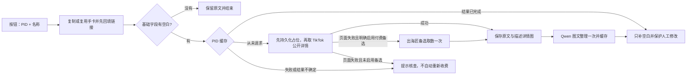

# PID 商品资料与手卡按钮

## 2026-10-02 可靠性修复（本轮待发布）

以下代码、测试及维修工具属于本轮未提交的修复；不能把云端单独执行过维修脚本等同于正式 Web 服务已经更新。

- 负责人确认：允许依据已确认商品类型推断常规用法，正文必须标明“推断”；禁止猜参数、功效和危险操作。推断也必须引用本次实际提供的文字或详情图。独立的安全常规句子可保留，含数值、设备护理或特殊操作的句子不采用；过滤不能改造成新的操作说明。（根据项目负责人确认及本轮代码）
- 符合当前来源约束的成功商品缓存继续永久复用。旧缓存引用的主图、SKU 图或未知图片不能填入新的空白：只读已存商品和详情图校验，不请求供应商、页面或模型；不合格字段留待重新整理，已有手卡文字不自动改写。失败公开页先用已保存 HTML 重新解析；若仍是验证页、暂时无详情数据或网络故障，则原子取得恢复资格后改试另一个公开 PID 地址。本次点击最多额外读取一次，重复失败需至少等待 60 秒后再次手动点击；错误 PID、摘要损坏以及不确定请求不能靠删除缓存解除。每次保留旧响应、旧收据和恢复占位；出海匠收费标记不变。（根据本轮代码）
- 可读名称/规格已经完整的 SKU 行不把内部编号、库存和状态送给模型；全部 SKU 及其规格值保留，不截取前若干 SKU。仅有编号关联的 SKU 不能擅自去掉编号。普通商品描述文本保留，真正超过文字安全上限时仍明确停止。（根据本轮代码；真实 282-SKU 商品验收）
- 飞书普通补录只填空白及明确的缺失标记。负责人最终确认：来源不可用或没有依据的字段写“待补齐”，不发提醒；这只是占位，不算填写成功。下次点击或维修取得真实资料后可替换占位，不能覆盖人工文字。写回后重新读取六项可见内容；仍有占位或模板缺项就是“基础资料待补齐”，不能因链接存在而报告全部完成。指定维修接口同样读取实际字段确认，保留实质性人工文字和视频区块。（根据项目负责人最终确认及本轮代码）
- 缓存维修支持只重整缺项：Qwen 新结果补缓存中原先 missing 的事实，以及不符合当前来源规则的旧图引用；其他可复用事实原样保留，不能覆盖手卡里已有人工内容。固定维修编号与原有模型收据阻止重复批次再次收费；校验成功的已有模型回复可离线恢复常规用法，不请求 Qwen。（根据本轮代码；负责人确认可承担缓存重新整理的 Qwen 费用）

维修脚本 `deploy/recover-public-handcards.cjs` 默认只读。`--all-cache --apply --restore-routine-usage` 优先使用现成缓存；加 `--reorganize-missing` 明确允许 Qwen 整理缺项，不访问商品供应商。`--offline-only` 禁止未就绪缓存进入模型整理，也禁止与实时恢复参数共用；可复用已保存回复而不再次请求模型。历史回复的图片编号不能直接当成本次详情图编号，仅本轮明确的详情图维修任务可复用图片引用，其余只恢复文字来源支持的用法。`--retry-public --pid <PID> --apply` 只允许一个指定 PID 的免费公开来源恢复，并要求付费备选关闭。`--apply` 本身在已有原始缓存尚未整理/整理失败时也可能调用 Qwen，不等同于零模型费用。每份手卡保留写前快照，保护原人工字段与所有非商品基础区块；遇到非预期改动立即停止批次。摘要与逐文档事件保存在 `/app/.data/maintenance/cached-handcards-v1/runs/`。这不是新增后台定时任务，也没有改动现有飞书自动化。（根据本轮代码）

开源候选审查：所检查的 [Product-and-Creator-Tracker 商品任务实现](https://github.com/MisterSeitz/TikTok-Shop-Product-and-Creator-Tracker/blob/main/main.py) 只输出 URL、页面标题，不足以替换商品描述/详情图解析。[PRO100CHOK 的 Python 项目](https://github.com/PRO100CHOK/tiktok-shop-product-scraper-python) 是调用 Apify Actor 的示例，不是完整的免费采集服务。[TikHub 商品详情 V3](https://docs.tikhub.io/348644013e0) 是支持美国市场的付费候选，需单独凭证与真实 PID 验收；本轮未接入、未充值，不承诺其可用率。（根据所链接的原项目代码及服务商文档，2026-10-02）

### 本轮核验范围与线上资料维修

本机完整回归包含独立测试 MySQL 的 SQL 场景、“待补齐”可再次补录规则，以及数据库结果和磁盘恢复结果共用详情图校验。Webpack 生产构建、类型与变更文件 ESLint 检查通过。本机临时工作树的依赖目录为外部软链接，默认 Turbopack 构建受本机路径约束失败，不能把 Webpack 结果等同于生产 CI 已验收。提交前正式服务仍运行 `3a03710136ff546af8eb73ae271cfc40549429e5`；最终测试数量、发布结果应查执行记录、GitHub Actions 和运行镜像，不以此静态快照当实时版本。（根据本轮执行记录）

2026-10-02 的云端维修记录有 64 份实际回填手卡，其中 60 份六项已有可见内容，4 份仍有缺项或旧模板字段缺失；逐份保护核验未发现人工文字、视频或非本次目标区块被覆盖。另两份标题 PID 与正文 PID 确实不同的文档已删除并解除后台关联，删除前快照在 `/app/.data/maintenance/pid-mismatch-20261002/`。一份 PID 后仅多出分号的卡实际数字一致，没有删除。（根据维修记录及飞书读回；完整不代表原有人工事实已逐条重新核验）

全量读回报告：`/app/.data/maintenance/handcard-audit-20261002/82e3e1dd-241f-44c5-8cc0-feaf252cf682.jsonl`，覆盖 406 个去重文档引用。原始分类为六项有内容 265、六项全空 69、部分缺项 65、模板重复 4、无可识别基础区块 1、原已删除不可读 2。其中全空卡包含 3 份明确测试卡；排除这些与已删除引用后，401 份业务卡中仍有 136 份不完整：66 份全空、65 份部分缺项、5 份模板异常。按创建时间统计最近一个月（2026-09-02 起），排除测试/已删除后仍有 62 份问题卡：18 全空、40 部分缺项、4 模板异常。按文档计数，同 PID 多份文档不能当成一个任务。（根据实际 API 读回，不以数据库 analysis_state=ready 当完整）

末轮额外检查发现防晒隔离霜的两项本轮新增字段错误复用了旧主图分析，已仅撤回这两项、用保存文字重整并读回，其他区块逐项保持不变；证据与快照在 `cached-handcards-v1/QuFhdDAgsoJm1sxzWtocBf3wnKf/legacy-evidence-correction-v1/`。该卡原模板仍缺使用方法行，不算完整。尚无资料、来源暂不可用或原来源没给参数的卡仍待补齐，未充值或启用收费商品备用接口，不能承诺第三方数据永不缺失。（根据末轮修正及当前边界）

## 本次业务范围

用户确认：点击现有“补录手卡”按钮时 **PID 必填，产品名称可不填**；系统可从精确 PID 商品资料取得名称并用于文档命名。PID 是唯一商品身份，不从网址英文名判断商品。美国市场固定 `us`。商品资料优先读取该 PID 对应的 TikTok 美国站公开商品详情数据；公开页面不可用且明确启用 `CHUHAIJIANG_FALLBACK_ENABLED` 时，才允许调用出海匠付费备选。Qwen 读取文字与商品描述区域详情图，主商品图和 SKU 图不参与分析；详情图最多 8 张。（根据项目负责人确认及当前代码）

普通表格手卡入口使用 `/api/feishu/automation`，应用动作另用 `/api/feishu/app-actions/handcard`。按产品文件夹中完整 `_PID` 后缀寻找手卡；多个匹配时选最近编辑的一份，名称规范为 `产品名称_PID`。2026-09-30 已删除名称含“测试”就强制新建的例外，所有产品按同一 PID 复用规则处理。（根据代码实现及项目负责人既有确认）

2026-09-30 负责人确认：普通补录只填空白；明确“刷新基础资料”才替换已有六项基础资料。新资料未提供的事实不能清除原有内容，处理期间被人工改动的字段跳过。视频文件、视频分析、中文翻译以及其他手写段落不属于本次商品资料写入范围。该新规则和刷新按钮尚未提交部署，不能视为线上已生效。

## 旧手卡如何补资料

在原多维表格找到该产品，确认完整 PID，重新点击“补录手卡”即可；不用删除旧卡或清空旧链接。系统会复用产品文件夹中匹配该 PID 的手卡，只补六项基础资料中的空白或完整等于“待补齐”“未找到”“暂无”“无”等的缺失标记；其他文字保留。六项都有实质性文字时跳过模型整理。已有成功 PID 缓存时直接复用；失败记录的免费资料恢复规则见上方 2026-10-02 修复，不能因此解除收费占位。

要替换已有资料，进入后台 `/admin/products` → 产品与手卡 → 对应关联手卡链接下的“刷新基础资料”。确认后只用已验证的整理缓存刷新选中手卡，不调用出海匠、公开商品页或模型。缓存不完整/未整理时拒绝刷新；缓存没有支持的字段保留原值。需要更新模型结果时，先执行同页带费用确认的“重新整理”，再刷新对应手卡。按钮位置暂按现有后台实现，不新增或修改飞书自动化。

独立管理员维修接口 `/api/admin/products/backfill` 仍保留“空白或缺失标记”的补充规则，用于指定文档维修；不同于普通飞书补录按钮，也不能替换实质性人工文字。此入口可能对既有失败缓存发起一次有持久身份的模型重整，不等同于完全不调用模型的“刷新”。

这不是自动批量补历史资料的任务。旧卡未放在产品文件夹、名称没有完整 `_PID` 后缀，或正文缺少基础字段时，需要先核对定位/模板，不能保证按钮会识别为该旧卡。飞书补录同 PID 多份手卡时只处理最近编辑的一份，不遍历重写全部旧卡；后台刷新针对所选的数据库关联手卡。

## 处理过程

1. 校验名称、PID，复制模板或复用手卡，首先回填当前行的手卡链接。
   PID 必须保留完整数字文本；如果飞书以超过安全整数范围的数字类型传入，则在建卡/收费前停止，要求改成文本字段重新粘贴，不能拿舍入后的 ID 取商品。
2. 检查模板的字段是否重复、正文商品 ID 是否冲突；没有可填的空白商品资料字段时，不调用整理模型。
3. 更新身份字段。需要补空白时读取 PID 的长期缓存；没有历史请求时，先记录请求占位，再读取一次 TikTok 公开商品页；页面受限、缺数据或 PID 不匹配且明确启用付费备选时，才调用出海匠一次。
4. 原响应和下载的详情图保存到云端持久卷。Qwen 接收商品文字及最多 8 张商品描述区域详情图，输出六项结构化资料，并为每项保留来源编号。主图和 SKU 图仅作为来源元数据保存，不送入模型。
5. 结果永久缓存。普通补录仅回写六个指定基础字段中的空白或明确缺失标记；有依据的事实写入，无依据的字段写“待补齐”，推断明确标注；实质性文字不覆盖。下一次补录可用真实资料替换占位，不需要先清空。
6. 状态回写当前行的“手卡状态”，不是视频文件所在格。部分图片缺失、字段缺失或资料矛盾作为提示，不阻止其余有依据的内容写入。

2026-10-02 负责人允许继续用免费公开商品来源补无缓存旧卡，Qwen 整理照常计费；没有新增机器人或其他提醒。维修脚本可加 `--retry-public --pid <PID> --document-id <已核验文档ID> --apply` 处理尚未建立商品缓存的指定旧卡：先确认正文 PID、唯一基础字段与没有进行中的任务，再调用正常缓存链路。异常来源不会阻断“待补齐”占位写入；占位仍计入缺项，不用于制造零失败统计。（根据项目负责人确认及本轮代码）

```mermaid
flowchart LR
  A[按钮：PID + 名称] --> B[复制或复用手卡并先回填链接]
  B --> J{基础字段有空白?}
  J -->|没有| K[保留原文并结束]
  J -->|有| C{PID 缓存}
  C -->|结果已完成| G[只补空白并保护人工修改]
  C -->|从未请求| D[先持久化占位，再取 TikTok 公开详情]
  C -->|失败或结果不确定| H[提示核查，不自动重新收费]
  D -->|成功| E[保存原文与描述详情图]
  D -->|页面失败且明确启用付费备选| I[出海匠备选取数一次]
  D -->|页面失败且未启用备选| H
  I --> E
  E --> F[Qwen 图文整理一次并缓存]
  F --> G
```

## 模块边界

| 文件 | 职责；以后改什么时看这里 |
| --- | --- |
| `lib/products/catalog.ts` | PID 级编排、同 PID 合并、缓存恢复、商品队列 |
| `lib/products/catalog-store.ts` | MySQL 原子占位与状态更新 |
| `lib/products/catalog-source.ts` | 出海匠单次请求、私有文件缓存、图片下载/格式验证 |
| `lib/products/tiktok-public-source.ts` | TikTok 公开商品详情读取、精确 PID 校验、公开来源缓存 |
| `lib/products/catalog-analyzer.ts` | 可配置 AI（默认 Qwen）提示词、结构化输出和字段级来源检查 |
| `lib/products/catalog-types.ts` | 六项资料结构、PID/缓存结构校验、安全错误文本 |
| `lib/feishu/automation.ts` | 现有按钮的链接交付、资料调用和当前行状态 |
| `lib/feishu/document.ts` | 标题规范、精确标签定位、缺失值保护、人工改动检查 |
| `lib/products/backfill.ts` / `app/admin/products/` | 指定手卡维修、后台缓存刷新与管理员确认 |
| `lib/feishu/request-dedup.ts` | 可选操作编号的持久接收记录；未传编号的旧调用不自动去重 |

根据负责人 2026-09-30 最新确认，本分支停用旧商品链接分析入口 `/api/products/parse-public`，部署后固定返回 HTTP 410；调试抓取也一并停用。历史解析代码保留但不再被应用入口引用。手卡按钮继续使用独立、可审计的 PID 公开详情读取模块，失败时只有明确启用后才能回退到出海匠，不进入旧的商品链接猜测/搜索链路。本轮跨模块修复及视频链路变化另见 [可靠性审计](RELIABILITY_AUDIT_20260930.md)。

## 数据、费用与失败语义

`product_catalog_cache` 以 `pid` 为主键；`fetch_state` 为 requested/ready/failed，`analysis_state` 为 waiting/requested/ready/failed；另存结构化 JSON、错误文本和时间。新增 `product_catalog_metadata`，保存精确来源、标题、店铺名、描述、主图地址和来源页。两张表均为 `CREATE TABLE IF NOT EXISTS`，不改写已有产品、视频或自动化任务。

TikTok 公开来源私有目录：`/app/.data/provider-evidence/tiktok-public/us/<PID>/`。保存原始 HTML、解析后的精确 PID 商品 JSON、摘要和一次性请求标记；公开页面失败也保存失败摘要。本轮修复增加 `retries/<旧收据摘要>/` 保存单次免费恢复的旧响应及排他占位；成功不刷新、失败不循环抓取，不重置付费标记。

私有持久目录：`/app/.data/provider-evidence/chuhaijiang/us/<PID>/`，不在可公开访问的媒体目录中：

- `request-started.json`：收费取数前排他创建并同步到磁盘，任何结果都不自动删除。
- `response.json` / `receipt.json`：原响应及 PID、地区、时间、HTTP 状态、SHA256。可能有临时签名图片链接，不提交 Git，不写日志。
- `images/` / `image-manifest.json`：实际详情图文件、大小、摘要和详情图标签。已下载图片不受签名链接到期影响。
- `analysis-started.json`：模型请求前的持久占位，防止再次自动提交。
- `organized.json`：整理结果，数据库更新中断时可以恢复；正常情况下数据库也保存一份结果。

数据库占位和磁盘标记共同保证“不自动再次发起收费取数”，**不能保证第三方没有对超时请求计费**。不确定收费状态、PID 不符或摘要损坏都停止；免费公开页的有限恢复与收费资格分开。普通按钮不能重置收费资格。管理员必须先核对供应商账单、原缓存和负责人指示；不得通过删缓存或重置状态来盲目恢复。

普通重复点击只使用旧整理结果。后台“重新整理”是显式确认费用的模型操作；“刷新基础资料”只将现有缓存写入选中手卡，不是重新取数或重新分析。首次成功保存原文但尚未组织时，可以使用该原文组织；不会重新取出海匠详情。整理后写飞书失败，下次补录仍复用结果填空，不会重跑模型。

每个应用进程同一时间处理一个商品任务，以限制图片和 Base64 内存；不同 PID 在该队列等待。同 PID 的并发调用共享结果。视频独立队列不变。没有后台定时刷新商品信息；价格、库存、销量如出现在原响应中，仅代表取数时快照。

## 配置与边界

| 配置 | 用途 |
| --- | --- |
| `CHUHAIJIANG_API_KEY` | 服务器环境变量，Bearer 鉴权；仅在 TikTok 公开详情不可用时调用的付费备选 |
| `CHUHAIJIANG_FALLBACK_ENABLED` | 只有显式启用才允许付费备选；本轮未修改生产配置 |
| 后台“商品基础资料”模型设置 | 默认 Qwen `qwen3.7-plus`；也可在后台选择服务商、接口地址、模型和密钥 |
| 现有飞书应用/模板/文件夹配置 | 不更改按钮接口、模板或应用鉴权；既有配置位置不变 |

出海匠固定入口 `GET /open/v1/products/{PID}?country=us&include=channel,core`，主机 `openapi.gateway.chuhaijiang.com`。45 秒取数超时，不跟随重定向、不重试；响应上限 10 MiB。

图片只接受已验证的 TikTok 图片 CDN 或 `oss-t.chuhaijiang.com` HTTPS 地址，拒绝 URL 内账号、非标准端口和未知主机。每个 PID 最多选择商品描述区域前 8 张详情图送入模型；主商品图和 SKU 图全部排除，也不补位。没有详情图时只使用文字资料。每图最多 8 MiB，纳入模型的图片合计最多 25 MiB；单次下载 25 秒、下载阶段最多 90 秒。依真实字节识别 JPEG/PNG/WebP，因此 `application/octet-stream` 不会误判为无图片。图片被限量或缺失时写入资料警告，绝不宣称已经读取未获取的图片。文字上限 10 万字符，超出停止而非静默截断。

商品模型请求限时 120 秒、最多输出 5000 tokens，默认 Qwen 不自动重试。若后台改为 OpenAI，则使用图片输入与严格结构化输出并设置 `store:false`。来源编号校验只能验证引用存在，不能从程序上保证模型绝不会读错图片，资料冲突及重要参数仍应人工确认。

飞书写入前保留原值快照，每次写块前按文档版本重读目标，并传入版本号；并发变动时跳过或停止，保留结果缓存。只匹配独立单行“标签：内容”，多行手写内容、嵌入对象和表格内其他区域不改写。飞书服务端协作版本语义仍需发布后真实按钮验收，不能将模拟测试当作全场景保证。

## 验证记录（2026-09-11，北京时间）

- 2026-09-23 使用真实美国站 PID `1732350695360139845` 验证公开详情：精确 PID、标题、店铺名、1179 字符描述、18 张主图、14 张描述详情图和 5 个 SKU 均成功解析；只有前 8 张描述详情图具备进入 Qwen 的资格，主图和 SKU 图均被排除。本次未调用出海匠。
- 同日另一个真实 PID 返回 TikTok 验证页而非详情数据，证明公开来源不能作为唯一来源；代码会记录该失败并进入出海匠备选，不循环抓取公开页面。

- 缓存样本 `1732350695360139845`（分装瓶）：复用此前已付费的出海匠原响应及 14 张图片，**本轮出海匠商品接口请求为 0 次**。
- 既有图文模型验证样本的六项均有结果：功能、5 种 SKU、尺寸/标称容量、使用步骤、人群、场景。容量图片之间的 30 mL/50 mL 矛盾被列为警告；人群标为推断。
- 真实结果已保存于上述 PID 的云端 `organized.json`。本次验证没有写入原手卡，部署后按钮可导入该结果，不再次调用两家接口。
- 商品/按钮/文档保护离线测试包含数字 PID 精度保护及线上模板兼容；视频相关回归 162 项通过；部署守卫测试 27 项通过。
- 线上模板已通过飞书 API 只读核验：六个商品资料字段及商品 ID、产品链接均存在；没有独立“商品名称”正文标签，名称只需通过文档标题表达，不添加多余字段或缺字段警告。
- 本地 Next.js 生产构建成功，TypeScript 与本次修改文件的 ESLint 检查通过。Linux 发布仍需既有 CI 验证。
- 在隔离的临时 MySQL 容器完成真实 SQL 测试：50 路取数占位仅 1 路成功，50 路整理占位仅 1 路成功，失败状态跨连接持久化，重复应用 schema 不改动旧产品数据。测试不连接生产数据库，临时容器/网络测试后回收。

## 发布前检查

以下是发布检查清单，不表示实时线上版本；最终提交与部署结果以发布记录为准。2026-09-11 项目负责人已确认提交、推送及部署；历史手卡仍仅在人工点击时补资料。

1. 发布前重新核对云端版本，保留当前工作区既有未提交文档改动，提交时只纳入本次代码/测试/说明。
2. 在服务器既有环境文件安全配置 `CHUHAIJIANG_API_KEY`，保留现有 OpenAI 和飞书密钥；不要把实际值写到命令输出、仓库或文档。
3. 保留完整持久卷及 MySQL 缓存，不能只迁数据库或只迁原文件。分装瓶样本应自动导入，禁止重新请求。
4. 历史样本 `1731886355135304543` 曾在 2026-09-08 完成收费测试，目前没有完整原始缓存。**本次已在其云端目录补入历史 `request-started.json` 标记，未调用任何接口、未伪造原始响应。** 上线前确认标记仍在；这个 PID 会停止并提示核查，不会被当作新商品再次扣费。只有找回完整原始证据或负责人明确另行授权后才能进一步处理。
5. 走现有隔离验证分支及 CI；获得负责人发布确认后上线。发布后再用已有缓存样本点击验收手卡链接、文档标题和六项文字；验证期间不重新请求商品接口、不改视频结果。

## 已知限制

本次真实验证证明一个 PID 的接口资料与图文模型可用，不代表所有商品都有完整资料。供应商若变更字段或图片主机，将停止或明确报告缺失，需要按真实响应调整该模块。没有对所有历史商品自动补资料，也没有自动恢复不确定的收费请求。模板若改变为多行标签或其它布局，需修改独立的字段定位模块及其测试。
